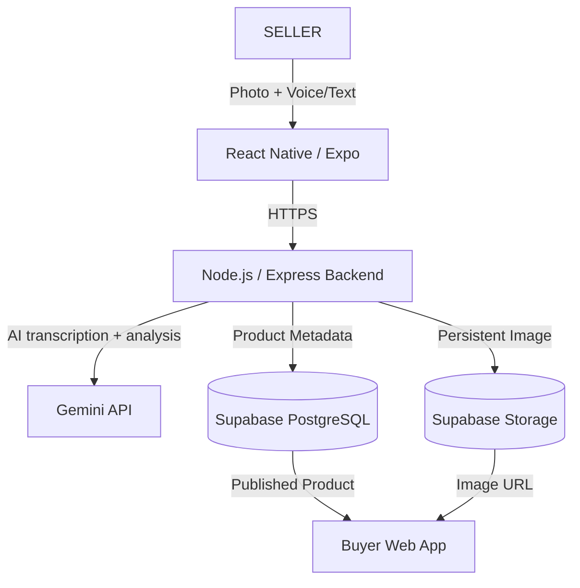

# SIH 2026 JUDGE PREPARATION & DEFENSE GUIDE: KarigarAI

**IMPORTANT:** This document is the absolute source of truth for the final intended KarigarAI architecture. Do not claim features outside this document during the SIH presentation. Distinguish carefully between features that are IMPLEMENTED today vs those that are PLANNED/FINAL INTEGRATION.

---

## PART 1 — EXECUTIVE PROJECT UNDERSTANDING

**1. What is KarigarAI?**
KarigarAI is a voice-first AI-assisted product cataloging and marketplace prototype designed to reduce the technical effort required for artisans to digitize their products.

**2. What real-world problem does it solve?**
Many artisans remain underserved by digital commerce because existing platforms can require typing, structured catalog creation, product photography skills, and digital literacy.

**3. Who are the users?**
Sellers: Rural artisans seeking to digitize their inventory with minimal friction.
Buyers: Customers looking for authentic handcrafted goods.

**4. What is the core innovation?**
Reducing the catalog-creation barrier for artisans. A seller can capture a product photo, describe the product naturally using voice in their preferred language, review AI-generated structured product information, receive a market-reference price suggestion, provide seller/location information, and publish the product for buyer discovery.

**5. Complete Journey:**
Physical craft → Photo → Natural-language voice → AI-assisted catalog creation → Missing information collection → Price reference → Seller information → Persistent image + product publishing → Buyer discovery.

**6. Strongest part of our prototype:**
The integration of the mobile voice/camera flow with the AI orchestration layer and the resulting automated catalog listing on a live buyer web portal.

### Pitches
**10-second pitch:** "KarigarAI is a voice-first AI-assisted cataloging tool and marketplace that helps artisans easily digitize and publish their crafts by just speaking and taking a photo."
**30-second pitch:** "Many artisans remain underserved by digital commerce because existing platforms require typing, structured catalog creation, and high digital literacy. KarigarAI removes this barrier. A seller captures a photo, describes it naturally via voice, and our AI-assisted backend automatically structures the catalog data, suggests a reference price, and publishes it instantly to an integrated buyer marketplace."

---

## PART 2 — COMPLETE SYSTEM ARCHITECTURE

*(Note: Supabase Storage integration for persistent images is marked as PLANNED/FINAL INTEGRATION. Ensure code is tested before claiming it is fully implemented live).*

**Mobile App (Frontend):** React Native + Expo + TypeScript. (IMPLEMENTED)
**Backend API:** Node.js + Express + TypeScript. (IMPLEMENTED)
**Database:** Supabase PostgreSQL. (IMPLEMENTED)
**Image Storage:** Supabase Storage. (PLANNED/FINAL INTEGRATION)
**Buyer Website:** React / Vite / Tailwind. (IMPLEMENTED)
**AI Processing:** Google Gemini API through backend. (IMPLEMENTED)

---

## PART 3 — CURRENT CODEBASE AUDIT

| Component | Technology | Purpose | Status | Important Files |
| :--- | :--- | :--- | :--- | :--- |
| Mobile App | React Native (Expo) | Artisan interface | IMPLEMENTED | `src/context/ProductAnalysisContext.tsx` |
| Web Frontend | React, Vite, Tailwind | Buyer marketplace | IMPLEMENTED | `website/src/pages/HomePage.tsx` |
| Backend | Node.js, Express | API Gateway & Orchestration| IMPLEMENTED | `backend/src/server.ts` |
| Database | Supabase (PostgreSQL) | Structured marketplace data | IMPLEMENTED | `backend/src/config/database.ts` |
| Image Storage| Supabase Storage | Persistent published images | PLANNED/FINAL INT. | Not fully verified in code yet |
| AI | Gemini API | Extract details from voice/image| IMPLEMENTED | `backend/` services proxy |
| Pricing | Rule-based / LLM | Market-reference price est. | PROTOTYPE | `src/services/pricing.service.ts` |
| Product Pub. | fetch (multipart) | Sync to backend | IMPLEMENTED | `src/services/api.ts` |
| Search | SQL ILIKE | Find products | IMPLEMENTED | `backend/src/services/catalog.service.ts`|
| Orders | Lead Gen Form | Capture buyer interest | IMPLEMENTED | `website/src/pages/OrderPage.tsx` |

---

## PART 4 — END-TO-END PRODUCT CREATION FLOW (The Golden Narrative)

1. **Add product:** Seller opens app and captures/selects a product photo.
2. **Language Selection:** Seller explicitly selects the input language before voice entry (reduces ambiguity, preserves intended script).
3. **Voice Entry:** Seller speaks naturally about the product.
4. **Backend Processing:** Microphone → Expo audio recording → backend speech endpoint.
5. **AI Processing (Gemini):** Backend sends audio to Gemini. Transcription is returned (e.g., Hindi stays in Devanagari, mixed languages preserve natural code-switching).
6. **Data Structuring:** AI structures the product information (Title, Desc, Category, Tags).
7. **Missing Info:** App asks for missing information where required.
8. **Pricing:** Suggested market-reference price is shown.
9. **Seller Info:** Seller provides location (e.g., Gwalior, Madhya Pradesh) and selling area (e.g., All India).
10. **Publish:** Seller publishes the product.
11. **Storage Integration:** Product data is stored in Supabase PostgreSQL. Product image is uploaded to Supabase Storage.
12. **Marketplace Discovery:** Buyer website retrieves and displays the published product.

---

## PART 5 — AI / GEMINI / SPEECH DEFENSE

*   **Final Architecture:** Gemini API credentials are kept on the backend and are not bundled into the mobile application. The mobile app never talks to Gemini directly.
*   **Speech-to-Text Flow:** Microphone → Expo audio recording → backend speech endpoint → Gemini → transcription → mobile app.
*   **Language Support:** The seller explicitly selects the input language before voice entry. This reduces ambiguity for short utterances and helps preserve the intended script (e.g. "ये handmade cotton bag है" remains exactly that).
*   **Failover & Reliability:** Backend-side Gemini failover allows the system to move to another configured provider credential when an eligible transient quota, rate-limit, or service-availability failure occurs.
*   **Judge Trap:** Do NOT describe `expo-speech` as speech-to-text. It is text-to-speech where used.

---

## PART 6 — PRICING

*   **Current State:** Market Reference / Suggested Selling Price.
*   **Explanation:** "The prototype uses configured category/reference pricing to provide a suggested selling-price range. This is a reference estimate, not a live marketplace quote."
*   **Fallback:** If the reference data is unavailable, the seller can enter their own price.
*   **Do NOT Claim:** Live Amazon pricing, live Flipkart pricing, real-time marketplace pricing, or guaranteed market price.

---

## PART 7 — BUYER WEBSITE / MARKETPLACE

*   **Buyer Capabilities:** Browse products, search, filter by category, open product details, and initiate an order/contact request.
*   **Do NOT Claim:** Payment gateway, shopping cart, checkout, online payment, or courier integration (unless explicitly implemented last minute).
*   **Safe Statement:** "The current marketplace demonstrates product discovery and buyer-to-seller order/contact initiation."

---

## PART 8 — DATABASE / SUPABASE AUDIT

*   **Structured Data:** PostgreSQL stores product metadata (Title, description, price, tags, etc.) and order inquiries.
*   **Image Data (Final Intended):** Supabase Storage handles image files. Product records store the image URL/reference.
*   **Why Supabase Storage?** "We separate structured product data from binary image storage. PostgreSQL stores product metadata, while Supabase Storage handles image files. This avoids relying on temporary mobile cache files or ephemeral backend filesystem storage." (Do not claim Render's local filesystem is durable production storage).

---

## PART 9 — SELLER LOCATION

*   **Current Implementation:** Seller-provided information (e.g., Location: Gwalior, Madhya Pradesh. Selling area: All India).
*   **Safe Wording:** "The seller can provide their location and intended selling area as part of the product information."
*   **Do NOT Claim:** GPS verification, automatic location detection, courier serviceability, or real-time delivery calculation.

---

## PART 10 — DATA PERSISTENCE

*   **LOCAL APP STORAGE:** Used for local drafts, cache, and the immediate user experience on the mobile device.
*   **SUPABASE (PostgreSQL):** Used for published marketplace data.
*   **SUPABASE STORAGE:** Used for persistent published product images (PLANNED/FINAL INTEGRATION).
*   *Note:* Do not claim AsyncStorage itself is the marketplace database. Local persistence supports the seller experience and draft/recent product access.

---

## PART 11 — SECURITY

*   **AI Keys:** Gemini credentials remain backend-only.
*   **Future Production Hardening:** Authentication, authorization, Row Level Security (RLS), restricted CORS, signed URLs where appropriate, and upload validation.
*   *Do not pretend production hardening is complete if it is not.*

---

## PART 19 — CORE DEMO FLOW (Follow this strictly)

**PRODUCT 1: लाख की चूड़ियाँ**
1. Seller opens Add Product.
2. Captures/selects photo.
3. Selects Hindi.
4. Speaks naturally about "लाख की चूड़ियाँ".
5. Audio goes to backend → Gemini. Hindi transcript is returned in Devanagari.
6. AI structures the product information.
7. App asks for missing information where required.
8. Seller reviews listing & sees suggested market-reference price.
9. Seller location is provided: Gwalior, Madhya Pradesh. Selling area: All India.
10. Seller publishes.
11. Product data is stored in marketplace backend. Image uploaded to Supabase Storage.
12. Buyer website retrieves and displays the published product instantly.

**PRODUCT 2: सूती टोट बैग (Short Demo)**
Use this as a shorter second demonstration to show that the system is flexible and not hardcoded to bangles.

---

## PART 25 — FINAL JUDGE Q&A ADDITIONS (Memorize These)

**Q: Why voice-first?**
**A:** "Many existing commerce workflows assume typing and structured data entry. Voice lets the seller describe the product naturally, while AI converts that description into structured catalog information."

**Q: Why Gemini?**
**A:** "Gemini provides multimodal and language capabilities suitable for interpreting product descriptions and images. We access it through our backend so credentials remain protected."

**Q: How do you make sure product images don't disappear? / How do you store images?**
**A:** "Published product images are uploaded to Supabase Storage rather than relying on temporary device cache or server-local files. The product record keeps the corresponding storage URL/reference, so the marketplace can retrieve the image independently of the seller's device." *(Use only once Supabase Storage is implemented)*

**Q: Why not store images directly in PostgreSQL?**
**A:** "Binary media is better separated from structured relational metadata. Storage is used for the image object and PostgreSQL stores the corresponding reference."

**Q: Is the price a live market price?**
**A:** "No. In the current prototype it is a market-reference/suggested price, not a guaranteed live marketplace quote."

**Q: Does the app automatically know the artisan's location?**
**A:** "The seller provides their location. The current MVP does not claim GPS verification."

**Q: Can buyers pay through the platform?**
**A:** "Not in the current MVP. The marketplace currently focuses on discovery and buyer-to-seller order/contact initiation."

---

## PART 26 — WHAT WE SHOULD NEVER CLAIM

Do NOT claim the following, as they are not currently implemented and will fail judge scrutiny:
*   Perfect AI accuracy.
*   Guaranteed pricing accuracy.
*   Automatic GPS verification.
*   Live logistics / courier integrations.
*   Payment processing / Gateways.
*   Guaranteed offline synchronization (fire-and-forget is not a durable offline queue).
*   Direct client-side Gemini access (Architecture dictates backend proxy).
*   Live Amazon/Flipkart pricing.
*   GNN/ML features (Unless actually implemented).
*   Production-grade security (Unless actually implemented).
*   *Do NOT describe user-created product images as permanently stored only on the device cache once published.*

---

## PART 28 — FINAL CHEAT SHEET

1. **Problem:** Traditional e-commerce excludes artisans lacking digital/typing skills.
2. **Solution:** Voice-first AI cataloging + integrated buyer marketplace.
3. **Architecture:** React Native → Node.js/Express → Gemini & Supabase (PostgreSQL + Storage) → React Web.
4. **AI Role:** Extracts structured JSON from multilingual voice & images via backend proxy.
5. **Pricing:** Simulated market-reference price; not a live Amazon API.
6. **Storage:** PostgreSQL for metadata, Supabase Storage for persistent images.
7. **Buyer Flow:** Browse → Search → View Details → Lead-Gen Order Form (No payments yet).
8. **Seller Location:** Manually provided (e.g., Gwalior), no GPS enforcement.
9. **Biggest Defense:** We prioritized solving the highest-friction step (getting artisans digitized) over building yet another checkout cart.

*Review this guide 5 minutes before entering the judging room. Rely on your working code. Good luck!*
